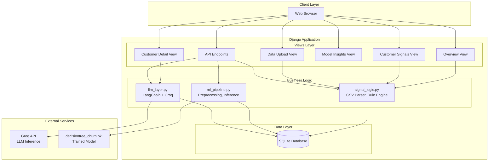
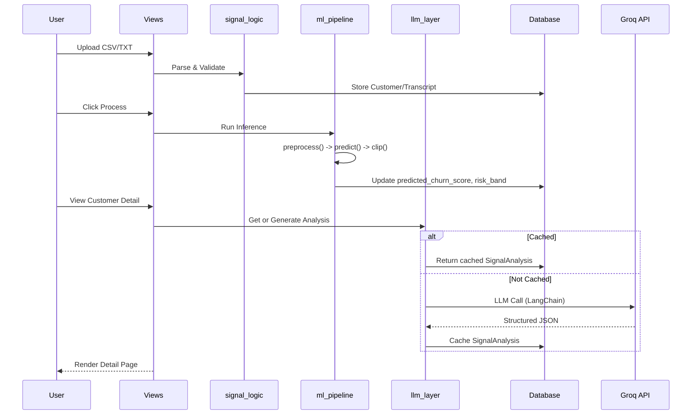
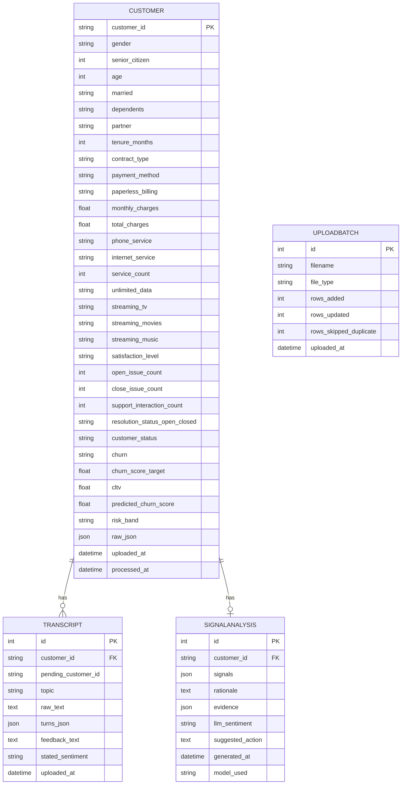

# Intelligent Customer Signal Detector


A full-stack Django application that ingests customer operational data and support transcripts, runs a pre-trained regression model to calculate churn risk scores, flags critical operational warning signs, and uses LLMs (via Groq API) to generate plain-English rationales and recommended next actions for customer support teams.

---

## Table of Contents

- [Overview](#overview)
- [Features](#features)
- [Architecture](#architecture)
- [Tech Stack](#tech-stack)
- [Project Structure](#project-structure)
- [Database Schema](#database-schema)
- [ML Pipeline](#ml-pipeline)
- [LLM Integration](#llm-integration)
- [API Endpoints](#api-endpoints)
- [Screens](#screens)
- [Setup & Installation](#setup--installation)
- [Usage](#usage)
- [Configuration](#configuration)
- [Docker Deployment](#docker-deployment)
- [Assumptions](#assumptions)
- [Example Input/Output](#example-inputoutput)
- [Contributing](#contributing)
- [License](#license)

---

## Overview

The Intelligent Customer Signal Detector is designed to help customer operations and retention teams proactively identify at-risk customers before they churn.

It combines:

- **Structured data analysis**: Customer demographics, contract details, billing info, service usage, and support history
- **Text analysis**: Support call transcripts with sentiment detection
- **Machine learning**: Pre-trained Decision Tree Regressor for churn score prediction (0-100 scale)
- **Rule-based flagging**: Deterministic concern detection (e.g., low satisfaction, unresolved issues, month-to-month contracts)
- **AI-powered explanations**: LLM-generated rationales grounded in detected signals

The system prioritizes customers by risk score and presents actionable insights in a clean, interactive dashboard.

---

## Features

### Core Functionality

| Feature | Description |
|---|---|
| Bulk CSV Upload | Drag-and-drop customer records with automatic parsing, validation, and deduplication |
| Transcript Ingestion | Multi-file upload for support call transcripts, linked by customer ID |
| ML Risk Scoring | Batch inference using pre-trained regression model, clipped to 0-100 scale |
| Risk Banding | Deterministic rule-based categorization (High/Attention/Low) |
| Signal Detection | Rule engine flags concerns (satisfaction, open issues, sentiment, resolution, contract, tenure) |
| AI Rationale | On-demand LLM generation of plain-English explanations, cached for performance |
| Interactive Dashboard | KPI cards, risk distribution chart, prioritized customer table |
| Advanced Filtering | Search, filter by risk/sentiment/resolution/contract, sortable columns |
| Customer Detail View | 360° profile with signals, rationale, transcript, and feedback |
| Model Insights | Feature importance visualization and model metadata |
| Manual Entry | Sandbox form for testing individual customer scenarios |
| Data Management | Danger zone for purging customers, transcripts, or full reset |

### UI/UX Highlights

- Responsive design with mobile-optimized layouts
- Color-coded risk indicators (red/amber/green)
- Chat-bubble transcript display
- Skeleton loading states for async operations
- Toast notifications for user feedback
- Collapsible sections for detailed data
- Keyboard-accessible navigation

---

## Architecture

### System Diagram



### Data Flow



---

## Tech Stack

| Layer | Technology | Purpose |
|---|---|---|
| Backend | Django 6.1 | Web framework, ORM, routing |
| Database | SQLite | Lightweight relational storage |
| ML | scikit-learn | Decision Tree Regressor for churn prediction |
| LLM | LangChain + Groq | Natural language rationale generation |
| Frontend | HTML5, CSS3, Vanilla JS | Server-rendered templates with interactivity |
| Styling | Custom CSS Design System | Responsive, accessible UI components |
| Containerization | Docker | Multi-stage production builds |
| WSGI | Gunicorn | Production server |

---

## Project Structure

```text
Intelligent-Customer-Signal-Detector/
 ├── Dockerfile                  # Multi-stage production container
 ├── Setting/                    # Django project configuration
 │   ├── __init__.py
 │   ├── settings.py             # Environment-based settings
 │   ├── urls.py                 # Root URL routing
 │   ├── asgi.py
 │   └── wsgi.py
 ├── customer_signal/            # Core application
 │   ├── __init__.py
 │   ├── admin.py                # Django admin registration
 │   ├── apps.py                 # App configuration
 │   ├── llm_layer.py            # LangChain + Groq integration
 │   ├── migrations/             # Database migrations
 │   ├── ml_pipeline.py          # ML preprocessing & inference
 │   ├── models.py               # Database models
 │   ├── signal_logic.py         # CSV parsing & rule engine
 │   ├── urls.py                 # App URL routing
 │   └── views.py                # View controllers
 ├── datasets/                   # Sample data files
 │   ├── Telco_customer_dashboard.csv
 │   ├── Telco_customer_dashboard1.csv
 │   └── Telco_customer_dashboard2.csv
 ├── media/                      # Uploaded files
 │   └── uploads/
 ├── static/                     # Static assets
 │   ├── css/
 │   │   └── dashboard.css       # Design system
 │   └── js/
 │       ├── dashboard.js        # Shared utilities
 │       └── data_upload.js      # Upload interactivity
 ├── templates/                  # HTML templates
 │   └── customer_signal/
 │       ├── base.html           # Base layout
 │       ├── overview.html       # Dashboard
 │       ├── customer_signals.html
 │       ├── customer_detail.html
 │       ├── model_insights.html
 │       ├── data_upload.html
 │       └── coming_soon.html
 ├── manage.py                   # Django CLI
 ├── requirements.txt            # Python dependencies
 └── start.py                    # Container startup script
```

---

## Database Schema



---

## ML Pipeline

### Preprocessing

The `preprocess()` function in `ml_pipeline.py` performs feature engineering identical to training:

| Transformation | Input | Output |
|---|---|---|
| Gender encoding | gender | ismale (0/1) |
| Partner flag | partner | ispartner (0/1) |
| Dependents flag | dependents | isdependents (0/1) |
| Phone service | phone_service | isphone_service (0/1) |
| Multiple lines | multiple_lines | ismultiple_lines (0/1) |
| Internet service | internet_service | isFiberOpticInternetService, DSLInternetService |
| Streaming TV | streaming_tv | isstreaming_tv (0/1) |
| Streaming movies | streaming_movies | isstreaming_movies (0/1) |
| Contract type | contract_type | iscontract_typeMonth-to-month, iscontract_typeTwo year, iscontract_typeOne year |
| Paperless billing | paperless_billing | ispaperless_billing (0/1) |
| Payment method | payment_method | 4 one-hot columns |
| Married | married | ismarried (0/1) |
| Offer | offer | isPromoOffer (0/1) |
| Streaming music | streaming_music | isstreaming_music (0/1) |
| Unlimited data | unlimited_data | isunlimited_data (0/1) |
| Satisfaction | satisfaction_level | Label encoded (1/2/3) |

### Inference Flow

```python
# 1. Load model artifact
bundle = pickle.load(open('decisiontree_churn.pkl', 'rb'))
model = bundle['model']
feature_columns = bundle['feature_columns']

# 2. Preprocess input
df_processed = preprocess(df_raw, is_training=False)

# 3. Align columns to training order
df_aligned = df_processed.reindex(columns=feature_columns, fill_value=0)

# 4. Predict and clip
preds = model.predict(df_aligned)
preds_clipped = np.clip(preds, 0, 100)
```

### Risk Banding Rules

| Score Range | Risk Band | Action |
|---|---|---|
| 70-100 | High | Immediate attention required |
| 40-69 | Attention | Monitor closely |
| 0-39 | Low | Standard care |

---

## LLM Integration

### LangChain + Groq Setup

```python
from langchain_groq import ChatGroq
from langchain.prompts import ChatPromptTemplate
from langchain.output_parsers import PydanticOutputParser

llm = ChatGroq(model="llama-3.3-70b-versatile", temperature=0.2)
```

### Prompt Structure

The LLM receives:

- Customer profile (demographics, account, services)
- Predicted risk score (from ML model)
- System-detected signals (rule-based flags)
- Support conversation (transcript turns)
- Customer feedback (free text + stated sentiment)

The LLM returns structured JSON:

- `signals`: List of 3-5 flag phrases
- `rationale`: 1-3 sentence plain-English explanation
- `evidence`: Label/value pairs grounding the rationale
- `llm_sentiment`: Independent sentiment read
- `suggested_action`: One concrete next step

### Caching Strategy

- First customer detail view: Live Groq API call (~2s)
- Subsequent views: Database cache hit (instant)
- Force refresh: `/api/customer/<id>/reanalyze/` endpoint

### Fallback Behavior

If Groq API fails (rate limit, network error):

- Falls back to template-based rationale from rule flags
- Logs warning, continues without blocking UI
- Marks `model_used` as `"rule-based-fallback"`

---

## API Endpoints

| Endpoint | Method | Description |
|---|---|---|
| `/` | GET | Overview dashboard |
| `/customers/` | GET | Customer signals list with filters |
| `/customer/<customer_id>/` | GET | Customer detail page |
| `/model-insights/` | GET | Model insights dashboard |
| `/data/` | GET | Data upload interface |
| `/api/upload/csv/` | POST | Bulk CSV upload |
| `/api/upload/transcripts/` | POST | Multi-file transcript upload |
| `/api/customer/manual/` | POST | Manual customer entry |
| `/api/process/` | POST | Run ML pipeline on unscored customers |
| `/api/customer/<id>/reanalyze/` | POST | Force regenerate LLM analysis |
| `/api/data/reset/` | POST | Danger zone data deletion |

---

## Screens

### 1. Overview Dashboard (`/`)

- KPI Cards: Customers Analyzed, High Risk, Open Issues, Negative Signals
- Risk Distribution: Horizontal bar chart (High/Attention/Low)
- Top 10 Table: Prioritized customers by risk score
- Empty State: Call-to-action when no data processed

### 2. Customer Signals (`/customers/`)

- Filter Bar: Search, Risk, Sentiment, Resolution, Contract, Sort
- Results Table: Paginated (25/page), sortable, clickable rows
- Active Filters: Badge count with clear option

### 3. Customer Detail (`/customer/<id>/`)

- Risk Card: Large score display with band indicator
- Profile Grid: Key metrics (age, tenure, contract, charges, satisfaction)
- Signal Breakdown: Rule-based concerns with severity levels
- AI Rationale: LLM-generated explanation with evidence list
- Support Conversation: Chat-bubble transcript display
- Customer Feedback: Quote with sentiment comparison
- Raw Data: Expandable full record view

### 4. Model Insights (`/model-insights/`)

- Model Summary: Algorithm, target, training info
- Feature Importance: Top 8-10 features with bar chart
- Correlation Notes: Key relationships (satisfaction ↔ churn)

### 5. Data Upload (`/data/`)

- Status Card: Current counts, last processed timestamp
- CSV Dropzone: Drag-and-drop with validation
- Transcript Dropzone: Multi-file support
- Manual Entry: Expandable form for testing
- Process Button: Trigger ML pipeline
- Danger Zone: Purge options with confirmation
- Upload History: Audit log of past uploads

---

## Setup & Installation

### Prerequisites

- Python 3.11+
- pip
- Virtual environment (recommended)

### Local Development

```bash
# Clone repository
git clone https://github.com/yourusername/Intelligent-Customer-Signal-Detector.git
cd Intelligent-Customer-Signal-Detector

# Create virtual environment
python -m venv venv
source venv/bin/activate  # On Windows: venv\Scripts\activate

# Install dependencies
pip install -r requirements.txt

# Set environment variables
cp .env.example .env
# Edit .env with your GROQ_API_KEY

# Run migrations
python manage.py migrate

# Create superuser (optional, for admin)
python manage.py createsuperuser

# Run development server
python manage.py runserver
```

Visit `http://127.0.0.1:8000/` in your browser.

---

## Usage

### 1. Upload Customer Data

- Navigate to **Data / Upload**
- Drag CSV file or click to browse
- Click **Upload CSV**
- Verify count in status card

### 2. Upload Transcripts

- Prepare `.txt` files named `{customer_id}.txt`
- Drag multiple files or click to browse
- Click **Upload Transcripts**
- Check linked count

### 3. Process Customers

- Click **Process Customers**
- Wait for ML inference (progress bar shown)
- Review toast notification with results
- Auto-redirect to Overview

### 4. Analyze Results

- View Overview dashboard for KPIs
- Click Customer Signals to filter/search
- Click any row for Customer Detail
- Review AI rationale and evidence

### 5. Manual Testing

- Expand **Add customer manually**
- Fill form fields
- Paste transcript text (optional)
- Submit and view detail page

---

## Configuration

### Environment Variables

Create `.env` file in project root:

```env
# Required
GROQ_API_KEY=your-groq-api-key-here

# Optional
DEBUG=True
SECRET_KEY=your-secret-key
ALLOWED_HOSTS=127.0.0.1,localhost
CHURN_MODEL_PATH=decisiontree_churn.pkl
```

### Model Configuration

Place your trained model file at project root or set custom path:

```python
# settings.py
CHURN_MODEL_PATH = BASE_DIR / "path/to/decisiontree_churn.pkl"
```

### Risk Thresholds

Modify in `signal_logic.py`:

```python
def risk_band(score):
    if score >= 70:
        return "High"
    elif score >= 40:
        return "Attention"
    else:
        return "Low"
```

---

## Docker Deployment

### Build Image

```bash
docker build -t customer-signal-detector .
```

### Run Container

```bash
docker run -p 8000:8000 \
  -e GROQ_API_KEY=your-key \
  customer-signal-detector
```

### Docker Compose (Optional)

```yaml
version: '3.8'

services:
  web:
    build: .
    ports:
      - "8000:8000"
    environment:
      - GROQ_API_KEY=${GROQ_API_KEY}
    volumes:
      - ./db.sqlite3:/app/db.sqlite3
      - ./media:/app/media
```

---

## Assumptions

- **Join Key**: `customer_id` is the unique identifier linking CSV records and transcript files
- **Risk Thresholds**: High ≥ 70, Attention 40-69, Low < 40 (documented, not changed ad hoc)
- **LLM Grounding**: Rationale is constrained to rule-detected signals, not free generation
- **Data Format**: Transcripts follow the confirmed `.txt` structure with header/separator/footer
- **Model Source**: Pre-trained `decisiontree_churn.pkl` with matching `preprocess()` function
- **Sentiment Labels**: Transcripts include pre-labeled sentiment (Positive/Neutral/Negative)

---

## Example Input/Output

### Input

#### Customer Profile (CSV row)

```csv
customer_id,gender,senior_citizen,partner,dependents,tenure_months,contract_type,monthly_charges,satisfaction_level,open_issue_count,resolution_status_open_closed
CUST-104,Female,0,No,No,8,Month-to-month,70.50,Low,2,NotResolved
```

#### Transcript (`CUST-104.txt`)

```text
Customer ID: CUST-104
Topic: billing dispute
Customer Status: Stayed
----------------------------------------
Customer: I've been charged incorrectly three times.
Agent: I apologize. Let me review your account.
Customer: This is unacceptable. I want to cancel.
Agent: I understand your frustration. Let me escalate this.
----------------------------------------
Feedback: I've contacted support several times and the issue is still not fixed.
Sentiment: Negative
```

### Output

#### Risk Score

`91/100` (High Risk)

#### Signal Breakdown

| Signal | Value | Concern |
|---|---|---|
| Satisfaction | Low | High |
| Open Support Issues | 2 | High |
| Sentiment | Negative | High |
| Resolution Status | Not Resolved | High |
| Contract Type | Month-to-month | Moderate |
| Tenure | 8 months | Moderate |

#### AI Rationale

> Low satisfaction, an unresolved support issue, and negative feedback are combining to drive a high predicted risk score. The customer is also on a month-to-month contract, which historically correlates with higher churn.

#### Evidence

- Satisfaction level: Low
- Open issues: 2 (unresolved)
- Sentiment: Negative
- Contract: Month-to-month

#### Suggested Action

> Review unresolved support issue and offer retention credit.

---

## Contributing

1. Fork the repository
2. Create feature branch (`git checkout -b feature/amazing-feature`)
3. Commit changes (`git commit -m 'Add amazing feature'`)
4. Push to branch (`git push origin feature/amazing-feature`)
5. Open Pull Request

---

## License

This project is licensed under the MIT License - see the [LICENSE](LICENSE) file for details.

---

## Acknowledgments

- Built with [Django](https://www.djangoproject.com/)
- ML powered by [scikit-learn](https://scikit-learn.org/)
- LLM integration via [LangChain](https://www.langchain.com/) and [Groq](https://groq.com/)
- UI inspired by modern dashboard design systems
